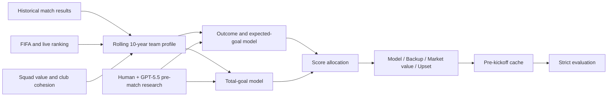

<div align="center">

[English](README.md) | [简体中文](README.zh-CN.md)

# World Cup Prediction Model

**Time-aware forecasts for match outcomes, total goals, and exact scores.**


[](https://github.com/Lucifercoo/world-cup-prediction-model/actions/workflows/ci.yml)

</div>

This project forecasts international football matches by combining FIFA and
live tournament rankings, rolling ten-year team profiles, squad-strength signals,
in-tournament form, tactical matchup signals, and cached pre-match context.

Every published formal evaluation uses the last prediction saved **before kickoff**.
Post-match reports and observed match shapes are never used to rewrite that
match's historical forecast.


The chart shows the realtime-assisted operational system, not the base model alone.

## Results

The strict evaluation covers 79 matches with a recorded pre-match forecast.
The published operational result includes human-initiated web research performed
with **GPT-5.5 at very-high reasoning effort**, followed by deterministic model
adjustments. It is not a model-only backtest.

| System | Outcome | Goal Top-1 | Goal Top-2 | Any exact score | Any score bucket | Median deviation |
| --- | ---: | ---: | ---: | ---: | ---: | ---: |
| Base model | **68.4%** | 21.5% | 57.0% | 25.3% | 57.0% | **0.667** |
| Realtime-assisted system | 67.1% | **32.9%** | **69.6%** | **35.4%** | **77.2%** | 0.700 |

Realtime context improved goal-bucket and exact-score coverage, but did not
improve outcome accuracy in this sample. Outcome, total-goal, and exact-score
metrics use regulation time; extra time and penalties are recorded separately.

Performance differs by tournament stage:

| Stage | Matches | Outcome | Goal Top-1 | Goal Top-2 | Any exact score |
| --- | ---: | ---: | ---: | ---: | ---: |
| Group stage | 48 | 64.6% | 25.0% | 64.6% | 29.2% |
| Knockout stage | 31 | 71.0% | 45.2% | 77.4% | 45.2% |

The aggregate goal distribution is well calibrated even though selecting the
correct Top-1 bucket for an individual match remains difficult:

| Total goals | Actual matches | Top-1 predictions |
| --- | ---: | ---: |
| 0-1 | 19 | 20 |
| 2-3 | 37 | 38 |
| 4-5 | 18 | 17 |
| 6-8 | 5 | 4 |

See the [full evaluation report](output/finished_realtime_cache_evaluation_summary.md)
and [base-versus-realtime comparison](output/base_vs_realtime_evaluation_summary.md),
plus the [match-level results](output/finished_realtime_cache_evaluation.csv).

## Forecast Output

Each match produces two goal buckets and four score candidates with separate
roles:

| Output | Purpose |
| --- | --- |
| Outcome reference | Win/draw/loss probability from the strength-edge and draw models |
| Goal Top-1 | Most likely total-goal bucket |
| Goal Top-2 | Alternative total-goal bucket for coverage |
| Model | Main score derived from expected goals, outcome, and Top-1 bucket |
| Backup | Score constrained to the Top-2 bucket |
| Market value | Independent squad-value and FIFA-strength reference |
| Upset | Low-probability score with a different outcome direction |

Example from the final:

| Match | Outcome | Goal Top-1 / Top-2 | Model | Backup | Market value | Upset |
| --- | --- | --- | ---: | ---: | ---: | ---: |
| Spain vs Argentina | Draw | 2-3 / 0-1 | 1-1 | **0-0** | 2-1 | 0-1 |

Regulation time ended 0-0; Spain won 1-0 after extra time. The regulation-time
forecast and tournament advancement are therefore evaluated as separate tasks.

## How It Works



### Model principles

The model has two prediction paths that share inputs but remain separate until
exact-score generation:

| Path | Main inputs | Calculation | Output |
| --- | --- | --- | --- |
| Outcome | FIFA/live points, squad-value gap, home advantage, rolling style, tournament state | A logistic strength comparison allocates non-draw probability; a separate draw model uses rank proximity, low-event style, and match incentives | `P(A win)`, `P(draw)`, `P(B win)` |
| Goals | Ten-year weighted scoring/conceding profile, opponent defense, ranking tempo, style matchup, cohesion, tournament stage | Team attack expectations produce two pre-match expected-goal values; their sum is adjusted for draw pressure, strength gap, and match shape | Continuous expected total and four goal-bucket probabilities |

The ten-year profile uses exponential time decay with a three-year half-life.
Opponent quality is iteratively reweighted so repeated wins over weak opposition
do not automatically create an elite profile. Each profile records scoring,
conceding, clean-sheet, both-teams-to-score, multi-goal, and high-total rates,
plus an interpretable style class.

The core calculation can be summarized as:

```text
time_weight = 0.5 ^ (match_age_days / three_years)

strength_edge = live_FIFA_point_edge
              + log(squad_value_A / squad_value_B) * value_weight
              + host_effect
              + chronological_tournament_adjustment

P(A | not draw) = sigmoid(strength_edge / point_scale)
P(A)             = (1 - P(draw)) * P(A | not draw)
P(B)             = (1 - P(draw)) * (1 - P(A | not draw))

base_match_goals = World_Cup_goal_rate * historical_style_modifier
lambda_A         = base_match_goals * attack_share_A * bounded_adjustments_A
lambda_B         = base_match_goals * (1 - attack_share_A) * bounded_adjustments_B

P(score i-j)     = Poisson(i; lambda_A) * Poisson(j; lambda_B)
P(goal_bucket k) = normalized(exp(-(expected_total - bucket_center_k)^2 / (2*sigma^2)))
```

`attack_share_A` combines the two teams' scoring and conceding histories,
outcome edge, clean-sheet and multi-goal rates, FIFA gap, value ratio, style
matchup, and host effect. Every multiplier is bounded in code so one signal
cannot determine the forecast by itself.

For a match, the model follows this sequence:

1. Convert the live point difference and squad-value ratio into a strength edge.
2. Estimate draw probability separately, then divide the remaining probability
   between the two teams.
3. Estimate each team's expected goals from its attack profile, the opponent's
   defense, ranking, style, host effect, cohesion, and tournament state.
4. Adjust a Poisson score matrix so its win/draw/loss mass matches the outcome
   path instead of counting the same strength signal twice.
5. Map the continuous total expectation to `0-1`, `2-3`, `4-5`, or `6-8` goals.
   Bucket probabilities come from distance to each bucket center; styles,
   strength gaps, match context, and tournament-stage constraints modify the
   continuous expectation and allowed high tail.
6. Combine a selected bucket with the expected goal difference to allocate the
   exact score. The model does not simply take the largest Poisson cell.

The columns named `xg_a` and `xg_b` are **model-implied pre-match expected
goals**. They are not event-level shot xG from a commercial provider and are not
the output of a trained deep-learning xG model.

Four exact scores serve different purposes:

| Score | Rule |
| --- | --- |
| Model | Most likely score consistent with the outcome path and Top-1 goal bucket |
| Backup | Score selected from the Top-2 goal bucket |
| Market value | Independent squad-value/FIFA allocation, constrained to Top-1 or Top-2 |
| Upset | Low-score alternative whose outcome direction differs from the favorite |

Pre-match context can include confirmed lineups, injuries, key-player status,
travel, weather, tactical shape, group incentives, and style matchup evidence.
Signals are cached with their prediction so later evaluation can preserve the
information available at kickoff.

The language model did not calculate the final forecast directly. It searched
and synthesized evidence into reviewed context fields; project code applied
those fields to probabilities, expected goals, goal buckets, and score choices.
The original workflow used GPT-5.5 with `very high` reasoning. Other models can
produce different context judgments. The reusable prompt and JSON contract are
in [`prompts/realtime_context_collection_zh.md`](prompts/realtime_context_collection_zh.md),
with a runnable input at
[`examples/realtime_context_example.json`](examples/realtime_context_example.json).

The exact formulas, parameters, and historical design decisions are documented
in [`docs/DESIGN.md`](docs/DESIGN.md). Task-oriented commands, output fields, the
LLM context workflow, and extension contracts are in
[`docs/USAGE_AND_EXTENSION.md`](docs/USAGE_AND_EXTENSION.md).

## Common Tasks

| Task | Command |
| --- | --- |
| Reproduce the published 79-match evaluation | `uv run python -m wc_model evaluate` |
| Prepare public data and run the model | `uv run python -m wc_model setup` |
| Inspect one date | `uv run python -m wc_model inspect --date 2026-07-20` |
| Inspect one team | `uv run python -m wc_model inspect --team Spain` |
| Generate a Markdown report | `uv run python -m wc_model report 2026-07-20 --no-build` |
| Validate LLM-collected context | `uv run python -m wc_model context prepare context.json` |
| Apply reviewed context | `uv run python -m wc_model context apply output/context-package` |
| List model experiments | `uv run python -m wc_model experiment list` |

## Quick Start

Requirements: Python 3.11 or newer and
[`uv`](https://docs.astral.sh/uv/).

Prepare the public inputs and run the complete pipeline with one command:

```powershell
uv sync
uv run pytest -q
uv run python -m wc_model setup
```

The setup command downloads the reviewed historical sources, fixes the 2026
FIFA ranking at the pre-tournament `2026-06-11` snapshot, builds squad-club
cohesion, creates an explicitly labeled FIFA-points squad-value proxy, disables
the optional key-player layer, and runs all eight prediction steps.

This public mode is a runnable model variant, but it cannot regenerate the
original formal predictions because that run used locally supplied squad
values and key-player signals that are not redistributed. The published
evaluation remains reproducible from the project-authored pre-match prediction
archive described below. Developers with their own permitted inputs can replace
the two generated CSV files and rerun:

```powershell
uv run python -m wc_model build
```

The build command generates rolling profiles, live rankings, in-tournament
state, style edges, base predictions, realtime predictions, the cache snapshot,
and betting-plan output in dependency order. Use `--replay` only after correcting
historical tournament results; normal runs update state incrementally.

Generate a dated Markdown report:

```powershell
uv run python -m wc_model report 2026-07-20
```

Reports rebuild the full prediction pipeline by default. Pass `--no-build` only
when intentionally rendering an existing prediction snapshot.

Rebuild the README statistics image from the checked-in evaluation data:

```powershell
uv run python scripts/generate_readme_stats.py
```

Reproduce the published 79-match strict evaluation directly from the compact
pre-match archive committed in `data/`:

```powershell
uv run python -m wc_model evaluate
```

The archive contains predictions created before kickoff, base-model outputs,
realtime audit fields, timestamps, and source hashes. Match results are loaded independently from
`world_cup_2026_results.csv`; hit and deviation fields are recomputed. The
compact archive reproduces the same 79 match rows as the original 1.89 GB cache.

Maintainers can independently verify the extraction against the full cache:

```powershell
uv run python -m wc_model evaluate --source cache --cache-dir <cache-path>
uv run python -m scripts.export_strict_prediction_archive --cache-dir <cache-path> --expected-matches 79
```

The first 25 tournament matches are excluded because no pre-kickoff cache was
recorded for them. They are never reconstructed from later model output.

List or run isolated model experiments through the same entry point:

```powershell
uv run python -m wc_model experiment list
uv run python -m wc_model experiment run low-block-effect
```

Experiment purposes and prerequisites are documented in
[`docs/EXPERIMENTS.md`](docs/EXPERIMENTS.md). Experiment outputs do not alter the
formal model unless a separately reviewed model change adopts their result.

## Evaluation Rules

- A historical forecast must exist before kickoff.
- Rolling profiles stop at the day before the match.
- In-tournament adjustments advance chronologically.
- Post-match statistics and commentary may update future team profiles only.
- Regulation time is used for outcome, total-goal, and exact-score metrics.
- Extra time and penalties are used only for advancement evaluation.
- Missing historical score columns remain missing; current outputs never fill
  old cache records.

These rules are designed to prevent look-ahead leakage and single-match
retrofitting. More detail is available in [the design document](docs/DESIGN.md).

## Repository Layout

```text
.
|-- data/          # Source datasets and tournament ledgers
|-- analysis/      # One-off model analyses
|-- backtests/     # Historical walk-forward evaluation
|-- builders/      # Data and tournament-state builders
|-- docs/          # Model design, data sources, and README assets
|-- evaluation/    # Prediction and cache evaluation
|-- experiments/   # Isolated model experiments
|-- output/        # Selected predictions and evaluation results
|-- prompts/       # Realtime evidence-collection prompts
|-- reports/       # Daily Markdown report generation
|-- scripts/       # Reproducible documentation utilities
|-- wc_model.py    # Unified project command entry point
|-- prediction_rules.py # Shared score and total-goal contracts
|-- predict*.py    # Base and profile prediction models
|-- realtime_*.py  # Pre-match context adjustment and cache generation
`-- profiles.py    # Rolling team profile generation
```

## Data and Limitations

The project uses public match results, FIFA ranking snapshots, squad-strength
signals, squad lists, weather data, and linked public reporting. Review
[data sources and redistribution notes](docs/DATA_SOURCES.md) before publishing
or repackaging the datasets.

This is an experimental forecasting system. Exact football scores are sparse
events, and good aggregate calibration does not imply reliable single-match
prediction. Historical evaluation does not guarantee future performance.

## Disclaimer

This project is for research, education, and reproducibility. Its predictions
are not betting, financial, legal, or other professional advice and do not
guarantee accuracy or returns. Users are responsible for complying with local
law and the terms governing every third-party data source.

The project is independent and is not affiliated with or endorsed by FIFA,
Transfermarkt, Wikipedia, any football association, competition organizer,
team, media organization, data provider, or betting operator. Names and
trademarks belong to their respective owners.

Read the complete [project disclaimer](DISCLAIMER.md).

## License

Source code is available under the [MIT License](LICENSE). Project-authored
datasets use CC BY 4.0, while third-party datasets retain their original terms.
See [data licensing](DATA_LICENSES.md) for file-level details.
