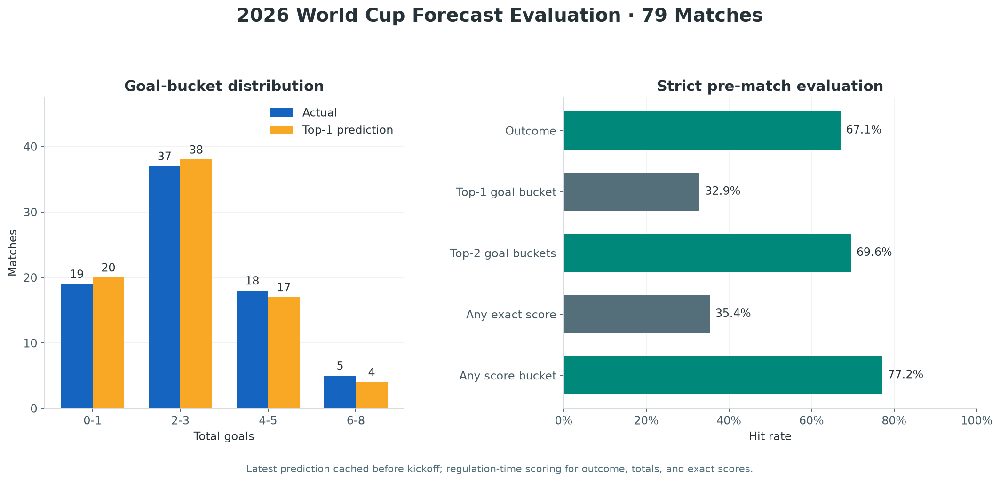
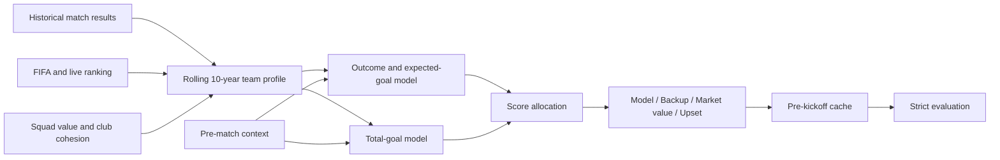

<div align="center">

# World Cup Prediction Model

**Time-aware forecasts for match outcomes, total goals, and exact scores.**


</div>

This project forecasts international football matches by combining FIFA and
live tournament rankings, rolling ten-year team profiles, squad value,
in-tournament form, tactical matchup signals, and cached pre-match context.

Every published evaluation uses the last prediction saved **before kickoff**.
Post-match reports and observed match shapes are never used to rewrite that
match's historical forecast.



## Results

The current strict evaluation covers 79 matches with an available pre-match
cache. Outcome, total-goal, and exact-score metrics use regulation time.
Extra time and penalties are recorded separately for advancement.

| Metric | Result |
| --- | ---: |
| Outcome accuracy | **67.1%** |
| Top-1 total-goal bucket accuracy | **32.9%** |
| Top-2 total-goal bucket coverage | **69.6%** |
| Any exact-score hit | **35.4%** |
| Any candidate in the correct goal bucket | **77.2%** |
| Median normalized score deviation | **0.700** |

Performance differs by tournament stage:

| Stage | Matches | Outcome | Goal Top-1 | Goal Top-2 | Any exact score |
| --- | ---: | ---: | ---: | ---: | ---: |
| Group stage | 48 | 64.6% | 25.0% | 64.6% | 29.2% |
| Knockout stage | 31 | 71.0% | 45.2% | 77.4% | 45.2% |

The aggregate goal distribution is well calibrated even though selecting the
correct Top-1 bucket for an individual match remains difficult:

| Total goals | Actual matches | Top-1 predictions |
| --- | ---: | ---: |
| 0-1 | 19 | 20 |
| 2-3 | 37 | 38 |
| 4-5 | 18 | 17 |
| 6-8 | 5 | 4 |

See the [full evaluation report](output/finished_realtime_cache_evaluation_summary.md)
and [match-level results](output/finished_realtime_cache_evaluation.csv).

## Forecast Output

Each match produces two goal buckets and four score candidates with separate
roles:

| Output | Purpose |
| --- | --- |
| Outcome reference | Win/draw/loss probability from model-implied expected goals |
| Goal Top-1 | Most likely total-goal bucket |
| Goal Top-2 | Alternative total-goal bucket for coverage |
| Model | Main score derived from expected goals, outcome, and Top-1 bucket |
| Backup | Score constrained to the Top-2 bucket |
| Market value | Independent squad-value and FIFA-strength reference |
| Upset | Low-probability score with a different outcome direction |

Example from the final:

| Match | Outcome | Goal Top-1 / Top-2 | Model | Backup | Market value | Upset |
| --- | --- | --- | ---: | ---: | ---: | ---: |
| Spain vs Argentina | Draw | 2-3 / 0-1 | 1-1 | **0-0** | 2-1 | 0-1 |

Regulation time ended 0-0; Spain won 1-0 after extra time. The regulation-time
forecast and tournament advancement are therefore evaluated as separate tasks.

## How It Works



The two main prediction paths stay separate until score generation:

- The **outcome path** estimates win, draw, and loss probabilities.
- The **total-goal path** estimates a continuous goal expectation and maps it
  into `0-1`, `2-3`, `4-5`, or `6-8` goals.
- Score generation combines the selected goal bucket with the expected goal
  difference instead of taking only the highest cell in a Poisson matrix.

Pre-match context can include confirmed lineups, injuries, key-player status,
travel, weather, tactical shape, group incentives, and style matchup evidence.
Signals are cached with their prediction so later evaluation can preserve the
information available at kickoff.

## Quick Start

Requirements: Python 3.11 or newer and
[`uv`](https://docs.astral.sh/uv/).

The fetch command downloads only immutable data cleared for automated
redistribution. Run it with `--list` and follow
[`docs/DATA_SOURCES.md`](docs/DATA_SOURCES.md) for manual or generated inputs
before running models that depend on them.

```powershell
uv sync
uv run python .\scripts\fetch_data.py
uv run python .\profiles.py
uv run python .\build_live_world_cup_rankings.py
uv run python .\predict_fifa_profile.py
uv run python .\realtime_context_adjusted_plan.py
```

Generate a dated Markdown report:

```powershell
uv run python .\daily_match_report.py 2026-07-20 --no-refresh
```

Rebuild the README statistics image from the checked-in evaluation data:

```powershell
uv run python .\scripts\generate_readme_stats.py
```

Strict evaluation requires a local `output/realtime_context_cache/` archive:

```powershell
uv run python .\evaluate_finished_from_realtime_cache.py
```

The full runtime cache is about 1.9 GB and is not committed. The derived
match-level evaluation CSV is included so the published figures remain
inspectable and the chart remains reproducible.

## Evaluation Rules

- A historical forecast must exist before kickoff.
- Rolling profiles stop at the day before the match.
- In-tournament adjustments advance chronologically.
- Post-match statistics and commentary may update future team profiles only.
- Regulation time is used for outcome, total-goal, and exact-score metrics.
- Extra time and penalties are used only for advancement evaluation.
- Missing historical score columns remain missing; current outputs never fill
  old cache records.

These rules are designed to prevent look-ahead leakage and single-match
retrofitting. More detail is available in [the design document](docs/DESIGN.md).

## Repository Layout

```text
.
|-- data/          # Source datasets and tournament ledgers
|-- docs/          # Model design, data sources, and README assets
|-- experiments/   # Isolated model experiments
|-- output/        # Selected predictions and evaluation results
|-- scripts/       # Reproducible documentation utilities
|-- predict*.py    # Base and profile prediction models
|-- build_*.py     # Ranking, profile, and tournament-state builders
|-- realtime_*.py  # Pre-match context adjustment and cache generation
`-- evaluate_*.py  # Historical and strict cache evaluation
```

## Data and Limitations

The project uses public match results, FIFA ranking snapshots, squad market
values, squad lists, weather data, and linked public reporting. Review
[data sources and redistribution notes](docs/DATA_SOURCES.md) before publishing
or repackaging the datasets.

This is an experimental forecasting system. Exact football scores are sparse
events, and good aggregate calibration does not imply reliable single-match
prediction. Historical evaluation does not guarantee future performance.

## Disclaimer

This project is for research, education, and reproducibility. Its predictions
are not betting, financial, legal, or other professional advice and do not
guarantee accuracy or returns. Users are responsible for complying with local
law and the terms governing every third-party data source.

The project is independent and is not affiliated with or endorsed by FIFA,
Transfermarkt, Wikipedia, any football association, competition organizer,
team, media organization, data provider, or betting operator. Names and
trademarks belong to their respective owners.

Read the complete [project disclaimer](DISCLAIMER.md).

## License

Source code is available under the [MIT License](LICENSE). Project-authored
datasets use CC BY 4.0, while third-party datasets retain their original terms.
See [data licensing](DATA_LICENSES.md) for file-level details.
