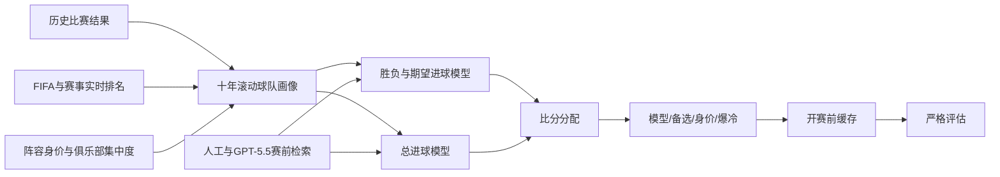

<div align="center">

[English](README.md) | [简体中文](README.zh-CN.md)

# 世界杯比赛预测模型

**基于时间边界预测比赛胜负、总进球和精确比分。**


[](https://github.com/Lucifercoo/world-cup-prediction-model/actions/workflows/ci.yml)

</div>

本项目结合 FIFA 排名、赛事实时排名、十年滚动球队画像、阵容强度、
赛中状态、风格克制和已缓存的赛前实时信息，预测国家队比赛。

所有正式评估均使用开赛前保存的最后一次预测。赛后报道和赛后观察到的
比赛形态不会被用于改写本场历史预测。


图中展示的是包含实时信息的实际工作系统，不是单独的基础模型。

## 直接预测一场比赛

首次使用先准备公开数据：

```powershell
uv sync
uv run python -m wc_model setup
```

假设明天由比利时主场迎战阿根廷，直接运行：

```powershell
uv run python -m wc_model predict-match `
  --team-a 阿根廷 `
  --team-b 比利时 `
  --kickoff 2026-09-03T20:00:00+08:00 `
  --stage friendly `
  --venue 布鲁塞尔 `
  --home b
```

使用 2026-09-02 公开版数据运行时，输出示例如下。数据更新后数值可能变化。

| 项目 | 结果 |
| --- | --- |
| 胜负参考 | 阿根廷胜 |
| 胜平负概率 | 阿根廷 52.4% / 平局 26.4% / 比利时 21.2% |
| 期望进球 | 阿根廷 3.01 / 比利时 0.63 |
| 总球 | Top-1 4-5球 / Top-2 2-3球 |
| 比分 | 模型 3-1 / 备选 2-1 / 身价 4-1 / 爆冷 1-1 |
| 风险 | 中：FIFA 排名接近；低比分一球差风险 |

程序还会显示本次实际使用的数据：

| 数据 | 是否使用 | 截止时间 | 状态 |
| --- | --- | --- | --- |
| FIFA/赛事排名 | 是 | 2026-07-20 | 未自动更新，距开赛 45 天 |
| 十年球队画像 | 是 | 2026-06-12 | 未自动更新，距开赛 83 天 |
| 阵容身价 | 是 | 2026 世界杯周期 | 公开代理数据 |
| 俱乐部集中度 | 是 | 2026 世界杯名单 | 2026 世界杯名单 |
| 首发、伤停、天气、关键球员 | 否 | - | 用户未提供，本次未使用 |

完整结果会同时写入：

```text
output/single_match_predictions/20260903_argentina-belgium.md
output/single_match_predictions/20260903_argentina-belgium.json
```

其中，`--home a` 表示第一支球队主场，`--home b` 表示第二支球队主场，
`--home neutral` 表示中立场。`--kickoff` 必须包含时区。

该命令**默认使用本地现有数据，不会自动联网更新**。即使数据较旧，也会继续预测，
并在结果下方列出每项数据的截止时间和状态，例如：

| 数据 | 默认处理 |
| --- | --- |
| FIFA/赛事实时排名 | 使用本地最新版本，并显示更新日期 |
| 十年球队画像 | 使用现有画像，并显示训练截止日期 |
| 身价 | 有数据就使用；公开版会明确标记为代理数据 |
| 俱乐部集中度 | 有数据就使用，没有则关闭该修正 |
| 首发、伤停、天气、关键球员 | 用户未提供时不使用 |
| 世界杯赛中状态 | 任意单场预测默认关闭，避免误用于其他赛事 |

FIFA 排名或十年球队画像完全缺失时无法形成核心预测，程序会提示先运行 `setup`。
当前球队画像覆盖 48 支 2026 世界杯球队。

`--stage` 可选值：

| 值 | 比赛类型 |
| --- | --- |
| `friendly` | 友谊赛 |
| `qualifier` | 预选赛 |
| `group` | 小组赛 |
| `r32` / `r16` | 三十二强 / 十六强 |
| `qf` / `sf` | 四分之一决赛 / 半决赛 |
| `final` / `third-place` | 决赛 / 三四名比赛 |

只提供 `--stage group` 时，程序不知道具体小组、轮次和积分，因此不会猜测出线形势，
并会在数据状态中标记该修正未使用。

## 评估结果

严格评估包含 79 场具有赛前预测记录的比赛。实际工作系统的结果包含人工发起的
联网检索，由 **GPT-5.5 以 very-high 推理强度**完成信息整理，再由确定性代码调整
模型输出。因此，这不是纯模型历史回测。

| 系统 | 胜平负 | 总球 Top-1 | 总球 Top-2 | 任一精确比分 | 任一比分所在桶 | 偏离度中位数 |
| --- | ---: | ---: | ---: | ---: | ---: | ---: |
| 基础模型 | **68.4%** | 21.5% | 57.0% | 25.3% | 57.0% | **0.667** |
| 实时信息系统 | 67.1% | **32.9%** | **69.6%** | **35.4%** | **77.2%** | 0.700 |

在这批比赛中，实时信息提高了总进球桶和精确比分的覆盖率，但没有提高胜平负准确率。
胜平负、总进球和精确比分均按常规时间评估；加时和点球单独记录。

不同赛事阶段的表现如下：

| 阶段 | 场次 | 胜平负 | 总球 Top-1 | 总球 Top-2 | 任一精确比分 |
| --- | ---: | ---: | ---: | ---: | ---: |
| 小组赛 | 48 | 64.6% | 25.0% | 64.6% | 29.2% |
| 淘汰赛 | 31 | 71.0% | 45.2% | 77.4% | 45.2% |

整体总进球分布接近真实分布，但单场 Top-1 桶仍然较难判断：

| 总进球 | 实际场次 | Top-1 预测次数 |
| --- | ---: | ---: |
| 0-1 | 19 | 20 |
| 2-3 | 37 | 38 |
| 4-5 | 18 | 17 |
| 6-8 | 5 | 4 |

完整结果见[评估报告](output/finished_realtime_cache_evaluation_summary.md)、
[基础模型与实时系统对比](output/base_vs_realtime_evaluation_summary.md)和
[逐场结果](output/finished_realtime_cache_evaluation.csv)。

## 预测输出

每场比赛输出两个总进球桶和四个承担不同作用的比分：

| 输出 | 作用 |
| --- | --- |
| 胜负参考 | 由实力差和平局模型得到的胜、平、负概率 |
| 总球 Top-1 | 概率最高的总进球桶 |
| 总球 Top-2 | 用于扩大覆盖的备选总进球桶 |
| 模型 | 根据期望进球、胜负方向和 Top-1 生成的主比分 |
| 备选 | 限定在 Top-2 桶内生成的比分 |
| 身价 | 独立的阵容身价与 FIFA 强度参考 |
| 爆冷 | 与热门方向不同的低概率比分 |

决赛示例：

| 比赛 | 胜负参考 | 总球 Top-1 / Top-2 | 模型 | 备选 | 身价 | 爆冷 |
| --- | --- | --- | ---: | ---: | ---: | ---: |
| 西班牙 vs 阿根廷 | 平局 | 2-3 / 0-1 | 1-1 | **0-0** | 2-1 | 0-1 |

常规时间结果为 0-0，西班牙在加时赛后 1-0 获胜。因此，常规时间预测和晋级结果
是两个独立的评估任务。

## 模型原理



模型包含两条共享输入、但在生成精确比分前保持独立的预测路径：

| 路径 | 主要输入 | 计算方法 | 输出 |
| --- | --- | --- | --- |
| 胜负 | FIFA/实时积分、身价差、主场优势、滚动风格、赛中状态 | Logistic 实力比较负责分配非平局概率；独立平局模型考虑排名接近、低事件风格和比赛目标 | `P(A胜)`、`P(平)`、`P(B胜)` |
| 进球 | 十年加权进失球画像、对手防守、排名节奏、风格克制、配合度、赛事阶段 | 先生成两队赛前期望进球，再用平局压力、实力差和比赛形态调整总量 | 连续总进球期望和四个总进球桶概率 |

十年画像采用半衰期三年的指数时间衰减。模型反复按对手水平修正权重，避免一支长期
战胜弱队的球队被直接评为顶级。画像记录进球、失球、零封、双方进球、多进球和大球
比例，并给出可解释的风格分类。

核心计算可概括为：

```text
时间权重 = 0.5 ^ (比赛距截止日天数 / 三年)

实力差 = 实时FIFA积分差
       + log(A队身价 / B队身价) * 身价权重
       + 主场影响
       + 按时间推进的赛事状态修正

P(A胜 | 非平局) = sigmoid(实力差 / 积分尺度)
P(A胜)           = (1 - P(平)) * P(A胜 | 非平局)
P(B胜)           = (1 - P(平)) * (1 - P(A胜 | 非平局))

比赛基础总球 = 世界杯场均进球 * 历史风格修正
lambda_A     = 比赛基础总球 * A队进球份额 * A队有界修正
lambda_B     = 比赛基础总球 * (1 - A队进球份额) * B队有界修正

P(比分 i-j) = Poisson(i; lambda_A) * Poisson(j; lambda_B)
P(总球桶 k) = normalize(exp(-(总球期望 - 桶中心_k)^2 / (2*sigma^2)))
```

`A队进球份额`结合两队历史进失球、胜负优势、零封和多进球比例、FIFA 差、身价比、
风格克制和主场影响。代码会限制每个修正项的范围，避免单个信号决定整场预测。

单场预测按以下顺序执行：

1. 将实时积分差和身价比转换为实力差。
2. 单独估计平局概率，再把剩余概率分给两队。
3. 根据本队进攻、对手防守、排名、风格、主场、配合度和赛事状态估计两队期望进球。
4. 调整泊松比分矩阵，使其胜、平、负概率质量与胜负路径一致，避免重复计算实力信号。
5. 将连续总进球期望映射到 `0-1`、`2-3`、`4-5` 或 `6-8` 球。桶概率由总球期望
   到各桶中心的距离产生，风格、实力差、比赛情境和赛事阶段会修正连续期望及大球上限。
6. 结合选中的总球桶与预期净胜球分配具体比分，而不是直接选择泊松矩阵最大单元格。

字段 `xg_a` 和 `xg_b` 是**模型推算的赛前期望进球**。它们不是商业数据商基于每次
射门提供的事件级 xG，也不是训练出的深度学习 xG 模型输出。

四个精确比分的规则如下：

| 比分 | 规则 |
| --- | --- |
| 模型 | 符合胜负路径和 Top-1 总球桶的最可能比分 |
| 备选 | 从 Top-2 总球桶中选择 |
| 身价 | 独立按身价/FIFA 分配，并限制在 Top-1 或 Top-2 内 |
| 爆冷 | 与热门胜负方向不同的低比分备选 |

赛前实时信息可包含确认首发、伤病、关键球员状态、旅途、天气、战术形态、小组形势和
风格克制证据。这些信号与预测一起缓存，后续评估才能保留开赛时可获得的信息。

语言模型不直接计算最终预测。它负责检索并整理证据，生成经过审核的结构化字段；
项目代码再将这些字段应用到概率、期望进球、总进球桶和比分。原始流程使用 GPT-5.5，
推理强度为 `very high`。其他模型可能得出不同的实时判断。可复用提示词位于
[`prompts/realtime_context_collection_zh.md`](prompts/realtime_context_collection_zh.md)，
可运行示例位于
[`examples/realtime_context_example.json`](examples/realtime_context_example.json)。

具体公式、参数和历史设计决策见 [`docs/DESIGN.md`](docs/DESIGN.md)。任务命令、输出字段、
大模型实时信息流程和扩展约束见
[`docs/USAGE_AND_EXTENSION.md`](docs/USAGE_AND_EXTENSION.md)。

## 常用任务

| 任务 | 命令 |
| --- | --- |
| 复现已发布的 79 场评估 | `uv run python -m wc_model evaluate` |
| 准备公开数据并运行模型 | `uv run python -m wc_model setup` |
| 预测一场新比赛 | `uv run python -m wc_model predict-match ...` |
| 查看指定日期 | `uv run python -m wc_model inspect --date 2026-07-20` |
| 查看指定球队 | `uv run python -m wc_model inspect --team Spain` |
| 生成 Markdown 日报 | `uv run python -m wc_model report 2026-07-20 --no-build` |
| 校验大模型采集的实时信息 | `uv run python -m wc_model context prepare context.json` |
| 应用审核后的实时信息 | `uv run python -m wc_model context apply output/context-package` |
| 查看模型实验 | `uv run python -m wc_model experiment list` |

## 快速开始

环境要求：Python 3.11 或更高版本，以及
[`uv`](https://docs.astral.sh/uv/)。

用一条流程准备公开输入并运行完整模型：

```powershell
uv sync
uv run pytest -q
uv run python -m wc_model setup
```

`setup` 会下载经过审核的历史数据源，将 2026 年 FIFA 排名固定在赛前
`2026-06-11` 快照，构建俱乐部集中度，生成明确标注的 FIFA 积分身价代理，
关闭可选关键球员层，并执行全部八步预测流程。

公开模式是可以运行的模型变体，但不能重新生成原始正式预测，因为正式预测使用了
未再分发的本地阵容身价和关键球员信号。项目提供的赛前预测档案仍可复现已发布评估。
拥有合法数据的开发者可以替换两张自动生成的 CSV，再执行：

```powershell
uv run python -m wc_model build
```

`build` 会按依赖顺序生成滚动画像、实时排名、赛中状态、风格克制、基础预测、实时预测、
缓存快照和方案输出。只有在修正历史赛果后才使用 `--replay`；正常运行按增量更新状态。

生成指定日期的 Markdown 报告：

```powershell
uv run python -m wc_model report 2026-07-20
```

报告默认先重建完整预测流程。只有明确需要渲染现有预测快照时才传入 `--no-build`。

根据仓库中的评估数据重新生成 README 统计图：

```powershell
uv run python scripts/generate_readme_stats.py
```

直接使用提交在 `data/` 中的精简赛前档案，复现 79 场严格评估：

```powershell
uv run python -m wc_model evaluate
```

档案包含开赛前生成的预测、基础模型输出、实时审核字段、时间戳和来源哈希。赛果从
`world_cup_2026_results.csv` 独立读取，命中和偏离指标会重新计算。该精简档案与原始
1.89 GB 缓存得到的 79 场结果一致。

维护者可以使用完整缓存独立核对提取结果：

```powershell
uv run python -m wc_model evaluate --source cache --cache-dir <cache-path>
uv run python -m scripts.export_strict_prediction_archive --cache-dir <cache-path> --expected-matches 79
```

世界杯前 25 场没有保存开赛前缓存，因此不纳入严格评估，也不会用后续模型输出重建。

通过统一入口查看或运行隔离实验：

```powershell
uv run python -m wc_model experiment list
uv run python -m wc_model experiment run low-block-effect
```

实验目的和前置条件见 [`docs/EXPERIMENTS.md`](docs/EXPERIMENTS.md)。除非经过单独审核的
模型修改正式采用实验结果，否则实验输出不会改变正式模型。

## 评估规则

- 历史预测必须在开赛前存在。
- 滚动画像的数据截止到比赛前一天。
- 赛中状态按时间顺序推进。
- 赛后技术统计和评论只能更新未来的球队画像。
- 胜平负、总进球和精确比分按常规时间评估。
- 加时和点球只用于晋级评估。
- 历史缓存缺少的比分字段保持缺失，不能用当前输出回填。

这些规则用于防止未来信息泄漏和针对单场结果进行反向拟合。详细说明见
[`docs/DESIGN.md`](docs/DESIGN.md)。

## 仓库结构

```text
.
|-- data/          # 数据源和赛事记录
|-- analysis/      # 一次性模型分析
|-- backtests/     # 历史滚动回测
|-- builders/      # 数据和赛事状态构建器
|-- docs/          # 模型设计、数据来源和 README 图片
|-- evaluation/    # 预测与缓存评估
|-- experiments/   # 隔离模型实验
|-- output/        # 选定的预测和评估结果
|-- prompts/       # 实时证据采集提示词
|-- reports/       # 每日 Markdown 报告
|-- scripts/       # 可复现文档与辅助工具
|-- wc_model.py    # 统一项目命令入口
|-- single_match_prediction.py # 任意单场预测入口
|-- prediction_rules.py # 共享比分和总球桶契约
|-- predict*.py    # 基础预测和画像预测模型
|-- realtime_*.py  # 赛前实时信息调整和缓存生成
`-- profiles.py    # 滚动球队画像生成
```

## 数据和限制

项目使用公开比赛结果、FIFA 排名快照、阵容强度信号、名单、天气数据和带链接的公开报道。
发布或重新打包数据前，请阅读[数据来源与再分发说明](docs/DATA_SOURCES.md)。

这是一个实验性预测系统。精确比分属于稀疏事件，整体分布校准良好不代表单场预测可靠。
历史评估也不能保证未来表现。

## 免责声明

本项目仅用于研究、教育和可复现性验证。项目预测不构成博彩、金融、法律或其他专业建议，
也不保证准确率或收益。使用者应自行遵守所在地法律和所有第三方数据源的使用条款。

本项目独立开发，与 FIFA、Transfermarkt、Wikipedia、任何足球协会、赛事组织者、球队、
媒体、数据提供商或博彩机构均无隶属、授权或背书关系。相关名称和商标归各自权利人所有。

请阅读完整的[项目免责声明](DISCLAIMER.md)。

## 许可证

源代码使用 [MIT License](LICENSE)。项目原创数据使用 CC BY 4.0，第三方数据仍遵循其原始条款。
各文件授权情况见[数据许可证说明](DATA_LICENSES.md)。
