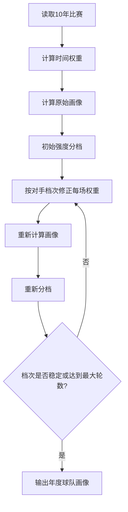
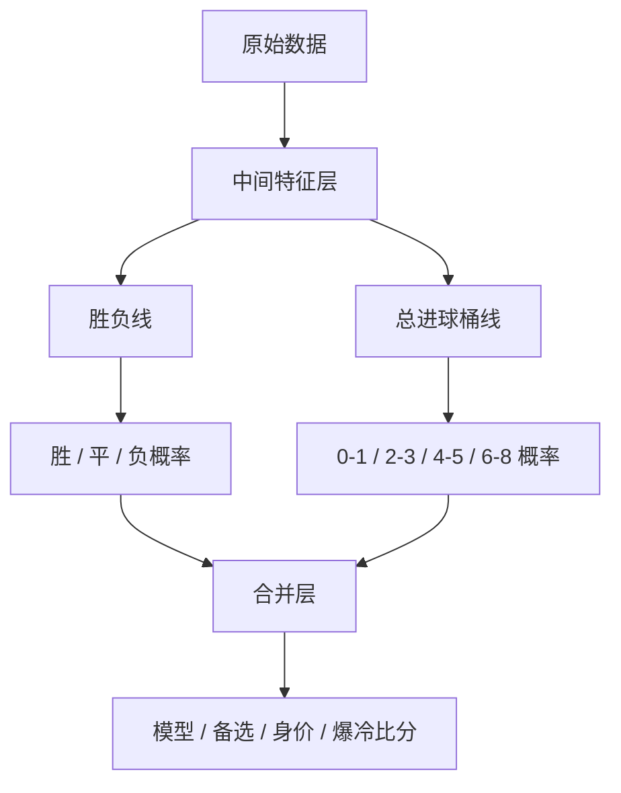

# 国家队画像预测模型设计 v0.1

## 目标

先为每支国家队生成年度画像，再做单场比赛预测。当前球队画像有三大主属性：实时强化 FIFA 排名、过去 10 年历史风格、当前球员身价。配合度、天气、旅途、伤病等只做小幅补正。

## 数据

来源：`martj42/international_results`

字段：

| 字段 | 用途 |
|---|---|
| date | 时间权重、年度画像切片 |
| home_team / away_team | 球队 |
| home_score / away_score | 进球、失球、胜平负 |
| tournament | 后续可做赛事权重，v0.1 暂不启用 |
| neutral | 主场影响，v0.1 暂只保留字段 |

不使用：

| 数据 | 原因 |
|---|---|
| 球员年龄 | 当前数据没有 |
| xG、射门、控球 | 当前数据没有 |
| 赔率 | 当前数据没有，且会改变模型性质 |

## 数据分层

| 数据层 | 例子 | 可用于赛前预测 | 可用于历史验证 | 用途 |
|---|---|---:|---:|---|
| 历史赛前数据 | 赛前 FIFA 排名、截止日前 10 年赛果画像、历史阶段总进球均值 | 是 | 是 | 严格回测和基础模型 |
| 静态赛前数据 | 赛前名单、Transfermarkt 身价、俱乐部集中度、赛前天气预报 | 是 | 只有历史同源数据完整时才可用 | 当前 2026 方案补正 |
| 实时赛前信息 | 当天伤停、预计阵型、媒体战术预期、盘口/大小球方向 | 是 | 否，除非历史可复现采集 | 当天方案补正 |
| 赛后数据 | 完赛比分、技术统计、赛后评论、`observed_shape` | 否 | 否 | 只更新后续画像或做赛后诊断 |

历史验证必须只跑可复现的赛前数据。2026 已完赛场次的复盘不能当验证准确率，只能叫赛后诊断。

## 年度画像

每年生成一版画像：

| 画像年份 | 数据窗口 |
|---|---|
| 2022 赛前回测 | 2012-11-19 到 2022-11-19 |
| 2023 | 2013-12-31 到 2023-12-31 |
| 2024 | 2014-12-31 到 2024-12-31 |
| 2025 | 2015-12-31 到 2025-12-31 |
| 2026 | 2016-06-12 到 2026-06-12 |

2026 世界杯预测使用 `2026` 画像。窗口截止日期以后已完赛结果才能进入下一版画像。

回测时，验证赛事不能进入画像训练。2022 回测使用世界杯开赛前一天 `2022-11-19` 作为画像截止日，`2022-11-20` 到 `2022-12-18` 的 64 场世界杯正赛作为金标准。

## 时间权重

近 10 年数据不等权。越近影响越大。

```text
time_weight = 0.5 ^ (age_days / half_life_days)
```

默认：

| 参数 | 值 |
|---|---:|
| 窗口长度 | 10 年 |
| 半衰期 | 3 年 |

权重示例：

| 距离画像截止日 | 权重 |
|---|---:|
| 1 年 | 0.79 |
| 3 年 | 0.50 |
| 5 年 | 0.31 |
| 8 年 | 0.16 |
| 10 年 | 0.10 |

## 原始指标

每支球队先计算加权原始指标。

| 指标 | 公式 |
|---|---|
| weighted_points_per_match | `Σ(points * weight) / Σ(weight)` |
| weighted_win_rate | `Σ(win * weight) / Σ(weight)` |
| weighted_draw_rate | `Σ(draw * weight) / Σ(weight)` |
| weighted_loss_rate | `Σ(loss * weight) / Σ(weight)` |
| weighted_goals_for | `Σ(goals_for * weight) / Σ(weight)` |
| weighted_goals_against | `Σ(goals_against * weight) / Σ(weight)` |
| weighted_goal_diff | `weighted_goals_for - weighted_goals_against` |
| clean_sheet_rate | `Σ(clean_sheet * weight) / Σ(weight)` |
| multi_goal_rate | `Σ(goals_for >= 2 * weight) / Σ(weight)` |
| conceded_multi_rate | `Σ(goals_against >= 2 * weight) / Σ(weight)` |
| high_total_goal_rate | `Σ(total_goals >= 3 * weight) / Σ(weight)` |
| both_score_rate | `Σ(both_teams_scored * weight) / Σ(weight)` |
| sample_size | 窗口内比赛数 |
| weighted_sample_size | `Σ(weight)` |

## 对手强度

v0.1 不用 Elo 作为最终画像，但用它初始化对手强度。后续通过画像迭代修正。

初始强度分数：

```text
raw_strength_score =
  z(weighted_points_per_match) * 0.35
+ z(weighted_goal_diff)        * 0.30
+ z(weighted_goals_for)        * 0.15
- z(weighted_goals_against)    * 0.15
+ z(clean_sheet_rate)          * 0.05
```

分档按同年球队分位数：

| 档次 | 分位 |
|---|---|
| 顶级 | 前 8% |
| 强 | 8%-25% |
| 中 | 25%-70% |
| 弱 | 后 30% |

样本量保护：

| 条件 | 规则 |
|---|---|
| sample_size < 12 | 不能进顶级 |
| weighted_sample_size < 6 | 不能进顶级或强 |

## 迭代修正

问题：中等队如果长期踢弱队，原始进球、失球、胜率会偏高。

解决：按对手档次重新加权每场比赛，再重新计算画像。

对手权重：

| 对手档次 | 权重 |
|---|---:|
| 顶级 | 1.35 |
| 强 | 1.15 |
| 中 | 1.00 |
| 弱 | 0.75 |

修正原则：

| 结果 | 修正含义 |
|---|---|
| 赢强队 | 加分更多 |
| 平强队 | 比普通平局更有价值 |
| 小负强队 | 扣分较少 |
| 大胜弱队 | 加分有限 |
| 输弱队 | 扣分更多 |

迭代流程：



停止条件：

| 条件 | 默认 |
|---|---:|
| 最大迭代次数 | 8 |
| 档次变化队伍数 | 0 |
| 重复状态 | 检测到循环即停止 |

如果 8 轮后没有稳定且没有重复状态，直接报错。若检测到二周期或多周期震荡，停止在当前状态并记录迭代次数。

## 风格分类

强度和风格分开。强队可以是防守型，弱队也可以是开放型。

风格规则：

| 风格 | 条件 |
|---|---|
| 攻守兼备型 | 进球高、失球低 |
| 进攻型 | 进球高、失球中高 |
| 防守型 | 失球低、总进球低 |
| 开放型 | 进球高、失球高、总进球高 |
| 低效型 | 进球低 |
| 均衡型 | 不满足以上规则 |

具体使用同年分位数：

| 标签 | 条件 |
|---|---|
| 进球高 | `weighted_goals_for >= P70` |
| 进球低 | `weighted_goals_for <= P30` |
| 失球低 | `weighted_goals_against <= P30` |
| 失球高 | `weighted_goals_against >= P70` |
| 总进球高 | `high_total_goal_rate >= P70` |
| 总进球低 | `high_total_goal_rate <= P30` |

## 输出文件

```text
world-cup-prediction-model/
├── data/
│   └── international_results.csv
├── output/
│   ├── team_profiles_2022_pre_world_cup.csv
│   ├── team_profiles_2022_pre_world_cup.md
│   ├── backtest_2022_matches.csv
│   ├── backtest_2022_summary.md
│   ├── team_profiles_2026.csv
│   ├── team_profiles_2026.md
│   └── group_score_predictions.csv
└── docs/
    └── DESIGN.md
```

`team_profiles_2026.csv` 字段：

| 字段 | 说明 |
|---|---|
| year | 画像年份 |
| team | 国家队 |
| tier | 顶级 / 强 / 中 / 弱 |
| strength_score | 强度分数 |
| style | 风格 |
| weighted_points_per_match | 加权场均积分 |
| weighted_win_rate | 加权胜率 |
| weighted_goals_for | 加权进球 |
| weighted_goals_against | 加权失球 |
| weighted_goal_diff | 加权净胜球 |
| clean_sheet_rate | 加权零封率 |
| multi_goal_rate | 加权多进球率 |
| conceded_multi_rate | 加权多失球率 |
| high_total_goal_rate | 加权大比分率 |
| both_score_rate | 加权双方进球率 |
| avg_opponent_strength_score | 平均对手强度 |
| sample_size | 原始比赛数 |
| weighted_sample_size | 加权比赛数 |
| iterations | 实际迭代次数 |

## 单场预测如何使用球队画像

当前预测模型先形成球队画像，再预测两队比赛。画像强度不再只靠 FIFA 排名。

预测时使用：

| 输入 | 用途 |
|---|---|
| 实时强化 FIFA 积分差 | 决定胜负基础概率 |
| Transfermarkt 当前总身价 | 修正胜负概率、总进球倾向和双方进球分配 |
| 过去 10 年球队风格 | 修正总进球倾向和比分形态 |
| FIFA 排名差 | 决定是否提高平局概率 |
| high_total_goal_rate、both_score_rate | 修正整场总进球倾向 |
| 进攻、失球、零封、多进球率 | 分配双方预期进球 |
| 俱乐部集中度配合度 | 小幅修正进攻和比赛开放度 |
| 主办国/中立场 | 小幅修正 |

### 下一版双线预测结构

当前实现先计算两队 xG，再用泊松比分矩阵汇总总进球桶。这会让均值附近的 `2-3球` 天然偏强。下一版改成“双线结构”：胜负线和总进球桶线共享中间特征，但分别建模。



中间特征进入两条线，但含义不同：

| 特征 | 胜负线作用 | 总进球桶线作用 |
|---|---|---|
| FIFA/live 排名差 | 决定强弱方向和胜率差 | 判断是否强弱失衡，影响小球/大球两端概率 |
| 身价差 | 修正强队胜率 | 强弱差大时提高单边大比分概率 |
| 双方总身价 | 不直接决定胜负 | 总身价高提高 `4-5球`，双方都高且接近时控制到 `2-3球`/`4-5球` |
| 球队风格 | 小幅影响胜负稳定性 | 进攻型推大球，防守型推小球，开放型提高两端波动 |
| 近期状态 | 调整胜/平/负概率 | 调整进攻火力、节奏和大小球倾向 |
| 比赛形态 | 铁桶、伤病等可提高平局 | `low_block` 推 `0-1球`，`open_game` 推 `4-5球`，`collapse_risk` 推 `6-8球` |
| 风格克制 | 不直接推翻胜负，只在模型判平且优势明确时做平局破局 | 按实力接近度门控后重分配双方 xG；总球只小幅修正 |
| 小组形势 | 平局接受度、必须赢 | 保守出线推小球，必须赢/追分推大球 |

合并层规则：

| 步骤 | 规则 |
|---|---|
| 1 | 胜负线给出胜/平/负概率和主方向 |
| 2 | 总进球桶线给出四桶概率，选 Top1 和 Top2 |
| 3 | 用“胜负方向 + 总球桶”约束比分总数和净胜球 |
| 4 | 四个比分项只能在 Top1/Top2 桶内生成，不能自行跳桶 |

这版目标是从根上降低 `2-3球` 默认优势，而不是给 `2-3球` 加固定折扣。

总进球基准按赛事阶段区分：

| 阶段 | 用途 | 2022 回测基准 |
|---|---|---:|
| 小组赛 | 小组出线优先，通常更保守 | 2.493 球/场 |
| 淘汰赛 | 决生死，末段开放度更高 | 2.625 球/场 |

2026 当前只预测小组赛，因此使用小组赛基准。2022 回测同时使用小组赛和淘汰赛基准。

比分输出规则：

| 输出 | 规则 |
|---|---|
| 赛果预测 | 实时 FIFA 积分差 + 身价边际 + 平局概率 |
| 推荐比分 | 先保证和赛果预测一致；再取概率最高的总进球组；组内选择能同时解释概率和实力差的具体总球数；最后用“总进球 + 实力差净胜球”反推比分 |
| 总进球候选 | 把所有比分概率按 `0-1 / 2-3 / 4-5 / 6-8` 四组合并，输出概率最高的两组 |

不再使用：

| 输入 | 原因 |
|---|---|
| 画像 strength_score 直接判断胜负 | 四届回测没有超过纯 FIFA 排名 |
| 画像 tier 直接判断强弱 | 与 FIFA 排名重复较多 |

## 验收标准

第一阶段只验收画像，不验收比分。

| 检查项 | 标准 |
|---|---|
| 可重跑 | 同样数据生成同样画像 |
| 无缺失 | 2026 世界杯 48 队必须全部有画像 |
| 样本保护 | 小样本队不能进入顶级 |
| 迭代稳定 | 8 轮内稳定或检测到重复状态，否则报错 |
| 可解释 | 每队能看到强度指标和风格指标 |
| 回测防泄漏 | 2022 世界杯正赛只做金标准，不进入赛前画像 |

## 2022 回测

当前先用最简单的赛果规则验证画像有效性：

| 条件 | 预测 |
|---|---|
| 默认 | 强度高者胜 |
| 两队强度分差 `< 0.30` | 在强度高者胜之外，追加平局候选 |

命中判断：真实赛果落在候选集合中即命中。当前合格线先设为 `70%`。

当前结果：

| 范围 | 场次 | 命中 | 命中率 | 平均候选数 |
|---|---:|---:|---:|---:|
| 全部 | 64 | 37 | 57.8% | 1.38 |
| 小组赛 | 48 | 26 | 54.2% | 1.33 |
| 淘汰赛 | 16 | 11 | 68.8% | 1.50 |
| 单候选场次 | 40 | 20 | 50.0% | 1.00 |
| 双候选场次 | 24 | 17 | 70.8% | 2.00 |

## FIFA 排名基线与融合回测

四届世界杯回测覆盖 `2010`、`2014`、`2018`、`2022`，每届使用开赛前最近一期 FIFA 排名。

| 模型 | 场次 | 命中 | 命中率 |
|---|---:|---:|---:|
| 纯 FIFA 排名 | 256 | 163 | 63.7% |
| FIFA + 原始画像强度 | 256 | 163 | 63.7% |
| FIFA + 画像残差 | 256 | 163 | 63.7% |
| 留一届验证：FIFA + 原始画像 | 256 | 162 | 63.3% |
| 留一届验证：FIFA + 画像残差 | 256 | 162 | 63.3% |

结论：当前画像强度分不能改进 FIFA 排名。画像后续只用于风格和比分分布，不作为胜负主信号。

## 2022 总进球回测

总进球使用 2022 世界杯 64 场实际总进球作为金标准。画像窗口截止到 `2022-11-19`，不读取 2022 世界杯正赛结果。

当前版本加入两项修正：

| 修正 | 含义 |
|---|---|
| 历史高比分倾向 | `high_total_goal_rate`、`both_score_rate`、`multi_goal_rate`、`conceded_multi_rate` 连续修正总进球 |
| 赛制阶段 | 小组赛和淘汰赛使用不同总进球基准 |

当前结果：

| 范围 | 场次 | 推荐总进球命中 | 命中率 | Top3 总进球命中 | 命中率 |
|---|---:|---:|---:|---:|---:|
| 全部 | 64 | 17 | 26.6% | 42 | 65.6% |
| 小组赛 | 48 | 14 | 29.2% | 31 | 64.6% |
| 淘汰赛 | 16 | 3 | 18.8% | 11 | 68.8% |

结论：单个总进球数命中率不高，Top3 总进球更适合作为输出。2022 的高比分爆点较多，仅靠赛果、排名、历史进失球无法解释点球、裁判尺度、临场红牌、末段追分等因素。

## 四届比分与总进球回测

当前默认比分模型已扩展到 `2010`、`2014`、`2018`、`2022` 四届世界杯。每届使用赛前 FIFA 排名和赛前 10 年画像；总进球基准用“留一届验证”，即预测某一届时只用其他三届的小组赛/淘汰赛均值。不读取实时上下文、比赛形态、赛后技术统计、赛后媒体评论。

| 范围 | 场次 | 赛果命中 | 精确比分命中 | 推荐总进球命中 | Top1总进球桶命中 | Top2总进球桶命中 | Top3总进球命中 |
|---|---:|---:|---:|---:|---:|---:|---:|
| 全部 | 256 | 51.2% | 9.0% | 21.9% | 43.0% | 76.2% | 65.2% |
| 小组赛 | 192 | 51.0% | 8.9% | 21.4% | 40.1% | 76.6% | 65.6% |
| 淘汰赛 | 64 | 51.6% | 9.4% | 23.4% | 51.6% | 75.0% | 64.1% |

留一届验证：

| 验证年份 | 赛果命中率 | 精确比分命中率 | Top1总进球桶命中率 | Top2总进球桶命中率 | Top3总进球命中率 |
|---:|---:|---:|---:|---:|---:|
| 2010 | 45.3% | 4.7% | 35.9% | 82.8% | 68.8% |
| 2014 | 57.8% | 4.7% | 35.9% | 67.2% | 54.7% |
| 2018 | 46.9% | 14.1% | 56.2% | 78.1% | 71.9% |
| 2022 | 54.7% | 12.5% | 43.8% | 76.6% | 65.6% |

概率校准：

| 预测最高赛果概率 | 场次 | 平均预测概率 | 实际命中率 |
|---|---:|---:|---:|
| 30%-40% | 28 | 32.8% | 17.9% |
| 40%-50% | 49 | 46.2% | 42.9% |
| 50%-60% | 65 | 54.7% | 55.4% |
| 60%-70% | 74 | 64.8% | 55.4% |
| 70%-85% | 38 | 72.7% | 73.7% |

结论：模型在 50%-60% 和 70%-85% 桶校准较好；60%-70% 偏乐观；30%-40% 桶虽然命中率不低，但三项概率接近，不适合单买胜平负。

## 彩票组合输出

`betting_plan_fifa_profile.py` 基于当前预测输出胜负参考 + 总进球组 + 四个比分。胜负参考不作为彩票项。

总进球定义：

| 项 | 含义 |
|---|---|
| 总进球组 | `0-1球`、`2-3球`、`4-5球`、`6-8球` |
| 输出 | 输出概率最高的两个总进球组，不再用 `4+` 覆盖 `4-8` |
| 组内取数 | 在选中的组内，用组内概率和实力差净胜球共同决定偏低端还是高端，例如 `2-3球` 可落到 2 或 3，`4-5球` 可落到 4 或 5 |

项数规则：

| 项 | 规则 |
|---|---|
| 胜负参考 | 通常取模型概率最高的 1 项；如果三项概率接近，强制选平局；不进入彩票项 |
| 总进球 | 输出 Top1 + Top2 两个总进球桶；Top1 是模型桶，Top2 是覆盖桶。Top2 不机械等于概率第二，开放对攻、崩盘风险、身价大比分信号可把高总球桶提入第二候选 |
| 比分1：模型 | 基础 xG 下，按 Top1 桶内取数 + 实力差净胜球反推 |
| 比分2：备选 | 按 Top2 桶内取数 + 实力差净胜球反推；用于覆盖模型主桶之外的第二情景，不保证比模型比分更大 |
| 比分3：身价 | 用 Transfermarkt 球队总身价映射强弱差，再压到 Top1 或 Top2 总进球桶内 |
| 比分4：爆冷 | 用 xG 泊松矩阵在 Top1 或 Top2 总进球桶内选择非主流结果；热门胜率 `>=70%` 时改为热门方压缩小胜分 |

外部媒体/论坛信息只用于调整比分，尽量不改胜负参考。

四届历史回测：

| 范围 | 场次 | 任一项命中 | 总进球桶命中 | 任一比分命中 | 平均项数 |
|---|---:|---:|---:|---:|---:|
| 全部 | 256 | 53.9% | 43.0% | 22.3% | 4.00 |
| 2010 | 64 | 48.4% | 35.9% | 21.9% | 4.00 |
| 2014 | 64 | 45.3% | 35.9% | 12.5% | 4.00 |
| 2018 | 64 | 67.2% | 56.2% | 28.1% | 4.00 |
| 2022 | 64 | 54.7% | 43.8% | 26.6% | 4.00 |
| 小组赛 | 192 | 53.1% | 40.1% | 22.4% | 4.00 |
| 淘汰赛 | 64 | 56.2% | 51.6% | 21.9% | 4.00 |

按风险：

| 风险 | 场次 | 任一项命中率 | 平均项数 |
|---|---:|---:|---:|
| 低 | 134 | 55.2% | 4.00 |
| 中 | 49 | 55.1% | 4.00 |
| 中高 | 36 | 55.6% | 4.00 |
| 高 | 37 | 45.9% | 4.00 |

这里的命中率是历史覆盖率，不是收益率。不同玩法赔率不同，命中一项也不等于整体盈利。

## 最新单场输出格式

用户询问最新比赛时，不只给模型原始结果。输出必须合并两类信息：

| 信息 | 用途 |
|---|---|
| 本地统计模型 | 给出 FIFA + 画像 + 比分矩阵的基础判断 |
| 外部媒体/论坛 | 只用于修正最新比赛，不进入回测 |

外部信息固定按以下顺序查，不临时更换来源：

| 层级 | 来源 | 用途 |
|---|---|---|
| 1 | Opta/The Analyst、FIFA、AP/Reuters、ESPN、BBC、The Guardian、CBS Sports、Al Jazeera | 主判断：胜负倾向、阵容、伤停、赛前概率 |
| 2 | Covers、DraftKings Network、FanDuel Research、VSiN、Sports Mole、RotoWire | 市场判断：总进球、双方进球、比分倾向 |
| 3 | Reddit 相关球队社区、r/soccer、媒体排名汇总帖 | 只看是否存在明显反向共识 |

规则：

| 情况 | 处理 |
|---|---|
| 固定源有当天比赛信息 | 纳入比分修正 |
| 固定源没有当天比赛信息 | 标记缺失，不换成随机小站 |
| 外部信息和模型冲突 | 默认只改比分，不改胜平负 |
| 多个源分歧明显 | 信心降为 `一般` |
| 只有 1 个普通源给出比分 | 只备注，不改方案 |
| 至少 2 个固定源同向 | 可替换同桶比分 |
| 1 个 Tier 1 源给出关键阵容/伤停 | 可单源触发比分修正，但必须注明原因 |

每场输出固定包含：

| 字段 | 说明 |
|---|---|
| 最终判断 | 综合统计模型和外部信息后的赛果 |
| 信心 | `看好` 或 `一般` |
| 胜负参考 | 只单列参考，不进入彩票项 |
| 彩票方案 | 1 个 Top1 总进球桶 + 模型比分 + 备选比分 + 身价比分 + 爆冷/压缩比分 |

信心规则：

| 信心 | 条件 |
|---|---|
| 看好 | 模型优势明显，且外部信息没有明显反向信号 |
| 一般 | 三项赛果概率接近、媒体分歧明显，或模型与外部信息冲突 |

最终彩票输出固定 5 项：Top1 总进球桶、模型比分、备选比分、身价比分、爆冷/压缩比分。胜负只单列为参考，不作为彩票项。总进球桶不因外部信息轻易改变。身价原始比分只保留为大比分风险信号；最终身价比分必须落在 Top1 或 Top2 总进球桶内。

比分修正门槛：

| 外部信号 | 是否改比分 |
|---|---|
| 单个普通预测源 | 不改 |
| 两个以上固定源同向 | 可改同桶比分 |
| 固定源方向分裂 | 不改，信心降为 `一般` |
| Tier 1 阵容/伤停强信息 | 可单源改，但必须说明触发原因 |

## 赛中修正层

赛中修正只使用已经完赛的本届世界杯比赛，不进入历史回测。

| 球队 | 触发结果 | 生效时间 | 进攻倍率 | 开放度倍率 | 说明 |
|---|---|---|---:|---:|---|
| United States | 4-1 Paraguay | 2026-06-13 09:00 之后 | 1.30 | 1.15 | 首战实际进球和总进球明显高于模型 2-0 / 2-3球 |

赛中修正只调整预期进球和总进球分布，不手动改胜平负主轴。

## FIFA 前 20 进球修正

历史数据中，FIFA 前 20 球队的自身进球均值高于其他球队。模型因此加入排名修正：

| 条件 | 修正 |
|---|---:|
| 球队 FIFA 排名前 20 | 该队预期进球 `1.08x` |
| 前 20 vs 非前 20 | 比赛总开放度 `1.05x` |
| 前 20 vs 前 20 | 不额外提高总开放度 |

彩票方案分两层：

| 层 | 用途 | 规则 |
|---|---|---|
| 保守 xG | 选择总进球桶 | 使用基础排名、风格、画像修正 |
| 备选 xG | 选择比分项 | 若有前 20 球队，前 20 球队进球 `1.55x`；前 20 vs 非前 20 开放度 `1.20x` |

也就是说，总进球桶保持保守覆盖，备选比分用于覆盖第二情景；有大球证据时可偏大，没有大球证据时允许更保守。

## 阵容强度比分

正式历史运行使用本地提供的参赛队身价，保存为：

```text
data/transfermarkt_world_cup_2026_values.csv
```

公开模式不抓取或分发 Transfermarkt 数据。`wc_model setup` 根据 2026 赛前 FIFA
积分生成对数映射代理，并在每行 `source` 中写明 `NOT Transfermarkt`。代理模式用于验证
工程流程，不能复现正式历史运行中身价相关的比分列。

```powershell
uv run python scripts/verify_data_inventory.py
```

身价现在有两种用途：

| 用途 | 说明 |
|---|---|
| 主模型属性 | 进入胜负概率、xG 总量、双方进球分配 |
| 比分3 | 生成身价强弱分配，再压到 Top1 或 Top2 总进球桶内 |

主模型身价修正：

| 项 | 规则 |
|---|---|
| 胜负概率 | `log(身价比)` 转成积分边际，补正 FIFA 排名 |
| 总进球 | 双方平均身价信号修正比赛开放度 |
| 进球分配 | `log(身价比)` 小幅影响双方 xG 份额 |
| 单队攻击 | 高身价队小幅提高攻击倍率，低身价队小幅降低 |

身价原始信号规则：

| 身价区间 | 基础进球 |
|---|---:|
| `< €50m` | 0 |
| `€50m-150m` | 1 |
| `€150m-260m` | 2 |
| `€260m-390m` | 3 |
| `€390m-520m` | 4 |
| `>= €520m` | 5 |

FIFA 排名校正：

| 条件 | 修正 |
|---|---:|
| 总球数 | 主要由双方身价区间相加决定 |
| 分配比例 | `log(身价比) * 0.80 + FIFA排名差 / 45 * 1.20` |
| 极端强弱差 | 弱方身价 `< €50m` 且身价比或排名差很大时，提高总球数 |

约束：

| 条件 | 规则 |
|---|---|
| 单队身价超过 `€550m` | 按 `€550m` 封顶 |
| 双方身价都 `>= €390m` | 按比例缩放，高进球方缩到 4 球 |
| 双方身价都 `>= €550m` | 按比例缩放，高进球方缩到 3 球 |
| 普通场总进球 | 最多 6 球 |
| 极端强弱差总进球 | 最多 8 球 |

最终身价比分：

| 步骤 | 规则 |
|---|---|
| 1 | 主模型先输出 Top1 总进球桶 |
| 2 | 再根据开放对攻、崩盘风险、身价大比分信号选择 Top2 覆盖桶 |
| 3 | 身价原始比分只作为强弱和大比分风险信号 |
| 4 | 最终身价比分必须落在 Top1 或 Top2 桶内，桶内用身价占比和 FIFA 排名差决定进球分配 |

## 俱乐部集中度配合度

26 人名单和所属俱乐部来自 Wikipedia 2026 世界杯 squads 页面，保存为：

```text
data/world_cup_2026_squad_clubs.csv
data/world_cup_2026_team_club_cohesion.csv
```

生成命令：

```powershell
uv run python -m builders.fetch_wikipedia_squad_club_cohesion
```

配合度规则：

| 条件 | 修正 |
|---|---:|
| 同一俱乐部最多人数占比 `>= 30%` | `+3%` |
| 同一俱乐部最多人数占比 `>= 23%` | `+2%` |
| 前三俱乐部人数占比 `>= 50%` | `+2%` |

该修正只影响 xG 和比赛开放度，不单独改变胜负主轴。

## 当前不做

| 项 | 原因 |
|---|---|
| 手动调档 | 不可复现 |
| 球员年龄 | 无数据 |
| 赔率融合 | 模型目标会变成市场预测 |
| xG 融合 | 无统一国家队 xG 数据 |
| 直接追求精确比分 | 先把球队画像做稳 |

## 实时战队情况层

实时层不参与历史回测，只用于当天/最近比赛方案。它读取基础模型输出，再按可查信息调整 xG、平局概率、总进球桶和比分项。

数据文件：

```text
data/realtime_team_context.csv
```

生成命令：

```powershell
uv run python .\realtime_context_adjusted_plan.py
```

输出文件：

```text
output/realtime_context_adjusted_plan.csv
output/realtime_context_adjusted_plan.md
```

缓存文件：

```text
output/realtime_context_cache/
├── latest_run_id.txt
├── latest_manifest.json
└── <run_id>/
    ├── manifest.json
    ├── inputs/
    │   ├── group_score_predictions_fifa_profile.csv
    │   ├── realtime_team_context.csv
    │   ├── match_shape_context.csv
    │   └── world_cup_2026_results.csv
    └── outputs/
        ├── realtime_context_adjusted_plan.csv
        └── realtime_context_adjusted_plan.md
```

每次运行实时方案必须自动保存缓存。`manifest.json` 记录运行时间、实际生效的运行参数、输入/输出文件路径、SHA256、行数和实时上下文命中数。后续复盘必须优先引用缓存快照，不能只看被覆盖后的最新 CSV。

字段规则：

| 维度 | 字段 | 规则 |
|---|---|---|
| 主客场/场地适应 | `home_adaptation_multiplier` | 主办国、熟悉场地、长期备战可上调 |
| 旅途适应 | `travel_multiplier` | 距离越远越低；找不到具体行程则空缺 |
| 天气适应 | `weather_multiplier` | 高温时，高纬/冷区球队下调，热区球队可小幅上调 |
| 配合度 | `cohesion_multiplier` | 阵容稳定上调，大量新人/临时组合下调 |
| 伤病 | `injury_multiplier` | 关键进攻球员伤缺下调本队进攻 |
| 防线伤病 | `opponent_attack_multiplier` | 本队后防伤缺时上调对手进攻 |
| 开放度 | `tempo_multiplier` | 天气、打法、伤病会改变总进球开放度 |

缺失字段不猜，按 `1.00` 处理。

## 风格克制层

风格克制层不再手写某一场谁克谁。它先把球队画像拆成多标签，再用历史同标签对阵的残差统计得到通用关系。

输入文件：

| 文件 | 作用 |
|---|---|
| `output/team_profiles_2026.csv` | 赛前 10 年球队画像，提供基础风格和进攻/防守/大小球指标 |
| `data/in_tournament_team_shape_profiles.csv` | 本届已完赛后的球队形态画像，只对下一场及以后生效 |
| `data/style_matchup_edges.csv` | 历史风格标签对阵残差，由 `builders/build_style_matchup_edges.py` 生成 |

风格标签包括：`attack_high`、`defense_strong`、`defense_fragility`、`high_event`、`low_event`、`control`、`suppression`、`transition_route`，以及 `style_attacking`、`style_complete` 等基础风格标签。

计算规则：

| 步骤 | 规则 |
|---|---|
| 1 | 对每年比赛，只用该年前 10 年画像给两队打风格标签 |
| 2 | 用实际得分份额减去强度期望，得到风格对阵残差 |
| 3 | 当前比赛用两队标签查残差表，得到 `style_matchup_edge` |
| 4 | `style_matchup_edge` 先过 `style_matchup_influence` 门控，实力越接近影响越大 |
| 5 | 本届球队形态标签可加入当前比赛标签，但不能反套回本场 |

当前保留一个通用画像对比项：`suppression` 对 `attack_high/style_attacking/high_event` 会压低被克制方 xG，并降低总球。它用于表达“压制型/防守抑制型球队克制纯进攻型球队”，不是某一场的硬编码。

正式预测里，风格克制只作为弱修正：

| 位置 | 规则 |
|---|---|
| 胜负方向 | 不直接翻转胜负。只有模型已经判平、`abs(style_matchup_edge) >= 0.060`、优势方概率和 xG 不落后，且不是 `controlled_favorite/low_event_favorite`，才允许平局破局 |
| xG/比分 | 可小幅重分配双方 xG，用于比分细节 |
| 总球 | 只按门控后的 multiplier 小幅修正 |

## 比赛形态层

比赛形态层解决的问题：FIFA、身价、历史风格只能说明强弱，不能说明比赛会被踢成“铁桶低转化”“开放对攻”还是“定位球乱战”。它分为两类：

| 层 | 何时使用 | 来源 |
|---|---|---|
| `pre_match_shape` | 赛前预测 | 阵容预测、媒体战术预期、伤停、天气、盘口/大小球信号 |
| `observed_shape` | 赛后写回 | 实际比分、技术统计、赛后评论 |

本届还维护一份球队级形态画像：`data/in_tournament_team_shape_profiles.csv`。它把已完赛的反常赛果和 `observed_shape` 转成球队属性，只对球队下一场及以后生效，不反套回本场验证。

| 画像属性 | 含义 | 后续用途 |
|---|---|---|
| `low_event_team` | 近期比赛体现低事件、低转化、铁桶或控场低比分 | 提高平局倾向，压低节奏 |
| `control_team` | 热门队有控场倾向 | 与对手防守抵抗组合时生成 `controlled_favorite` 候选 |
| `transition_route_team` | 弱队反击、定位球、直接进攻实际成立 | 保留弱队进球路线 |
| `open_event_team` | 近期比赛开放或大比分 | 保留大球尾部 |
| `defensive_resistance_team` | 对手 xG 高但实际丢球少，或低位防守有效 | 降低热门队大胜概率 |
| `defensive_fragility_team` | 丢球明显高于预期或崩盘 | 强弱局保留崩盘风险 |

第一次把该画像直接合入正式预测的实验结果变差：48 场 Top1 总球 `19->20`，但 Top2 `35->32`、精确比分 `21->19`、比分桶覆盖 `40->37`、平均偏离 `0.862->0.897`。

弱合入实验 `WC_TEAM_SHAPE_PROFILE_MODE=micro` 只用 35% 乘数、不写入单场形态标签：平均偏离 `0.862->0.860`，但 Top2 `35->34`、比分桶覆盖 `40->39`，精确比分不变。因此当前只生成、缓存和展示球队形态画像，不参与正式预测合并。下一步若继续试，只允许在“没有明确赛前形态”或“球队已有至少两场画像”时使用，避免和单场形态重复计算。

赛前可用信号：

| 信号 | 用法 |
|---|---|
| 弱队预计 5 后卫/低位防守 | 标记 `low_block` |
| 强队缺高点、核心爆点替补、边路打不开风险 | 标记 `low_event_favorite` |
| 弱队有中锋/速度点/转换强 | 标记 `transition_dog` |
| 弱队定位球强，强队门将/中卫不稳 | 标记 `set_piece_risk` |
| 两队历史高进球、弱队也主动进攻 | 标记 `open_game` |
| 强弱差极大且弱队防线/纪律差 | 标记 `collapse_risk` |

形态标签和修正：

| 形态 | 作用 |
|---|---|
| `low_block` | 降低比赛开放度，提高平局概率，压低强队净胜球 |
| `low_event_favorite` | 降低强队进攻，降低 4+，提高 0-0/1-0/1-1 |
| `transition_dog` | 提高弱队进球，提高 1-1/2-2 |
| `set_piece_risk` | 提高弱队 1 球概率，提高平局 |
| `open_game` | 提高双方进球，保留 4+ |
| `open_mismatch` | 强弱差 + 开放比赛，提高强队进攻和 4+ |
| `collapse_risk` | 弱队崩盘风险，提高大比分 |
| `style_edge_a` / `style_edge_b` | 只用于记录明确赛后/人工证据；正式预测优先使用通用风格克制层 |

赛前形态必须有赛前证据，且只能中等幅度修正。`低转化`、`崩盘`、`实际踢开`、`控制住` 这类赛后判断只能写入 `observed_shape`，不能写入 `pre_match_shape`。单条形态不得把总进球从高桶直接压到 `0-1球`，也不得从常规桶直接拉到 `6-8球`。赛中状态层允许逐档压低总进球桶；`2-3球 -> 0-1球` 只在状态压低信号 `>= 0.92` 且平局概率 `>= 0.37` 时触发。

关键规则：

| 情况 | 规则 |
|---|---|
| `low_block` / `low_event_favorite` | 不单独硬调全局平局率，而是通过降低强队 xG、提高平局概率实现 |
| `open_game` / `open_mismatch` | 不压总进球，保留备选高比分 |
| `set_piece_risk` / `transition_dog` | 上调弱队进球，不一定改变胜负主轴 |
| `observed_shape` | 只在赛后写入球队本届画像，不用于解释已经预测完的比赛 |

强弱局的弱队进球不只看弱队强度。若强队本身偏开放、零封率不高、被多进球率高，而弱队有反击或双方进球倾向，则在 xG 层小幅提高弱队进球期望；低总球或极端碾压局仍允许零封。

当前 2026 前 16 场赛后诊断说明：

| 比赛 | 形态 |
|---|---|
| Germany 7-1 Curaçao | `open_mismatch + collapse_risk` |
| Spain 0-0 Cape Verde | `low_block + low_event_favorite` |
| Netherlands 2-2 Japan | `transition_dog + open_game` |
| Belgium 1-1 Egypt | `low_block + transition_dog` |
| Saudi Arabia 1-1 Uruguay | `set_piece_risk + low_event_favorite` |
| Iran 2-2 New Zealand | `open_game + transition_dog` |

这些形态如果没有赛前来源，不能用于本场验证，只能用于后续球队画像更新。

实时层的赛前修正规则：

| 情况 | 影响 |
|---|---|
| 胜平负三项接近，或平局概率高且有高温/旅途/伤病惩罚 | 比赛开放度下调 |
| 高温且有一方天气适应倍率 `<= 0.95` | 比赛开放度强下调 |
| `low_block` / `low_event_favorite` | 降强队 xG、升平局概率 |
| `open_game` / `open_mismatch` / `collapse_risk` | 保留或提高 `4-5球` / `6-8球` 倾向 |
| 身价比分遇到高温/旅途/伤病 | 只微调原始身价信号；最终仍必须压进 Top1 或 Top2 总进球桶 |

## 小组形势和平局接受度层

小组赛和平局的关系不能只看两队强弱。不同轮次下，球队对平局的接受度不同：

| 轮次 | 典型状态 | 平局含义 |
|---|---|---|
| 第一轮 | 所有球队 0 分 | 平局通常可以接受，尤其弱队更愿意先拿 1 分 |
| 第二轮 | 首轮赢球 | 平局可接受，4 分基本保留主动权 |
| 第二轮 | 首轮打平 | 平局中性，2 分仍有出线机会但压力上升 |
| 第二轮 | 首轮输球 | 平局不太够，必须提高赢球需求 |
| 第三轮 | 6 分或基本出线 | 平局可接受，甚至可能主动降节奏 |
| 第三轮 | 4 分 | 平局大概率可接受 |
| 第三轮 | 3 分 | 平局是否够用取决于净胜球和同组形势 |
| 第三轮 | 0-2 分 | 平局通常不够，必须提高进攻需求 |

实现规则：

| 字段 | 含义 |
|---|---|
| `group_round` | 根据赛前已赛场次推断第几轮 |
| `draw_acceptance_a/b` | 双方赛前对平局的接受度，范围约 `0.55-1.20` |
| `group_draw_multiplier` | 两队接受度合成后的平局概率倍率 |
| `group_tempo_multiplier` | 平局可接受时小幅降节奏，必须赢球时小幅提节奏 |
| `group_context_notes` | 赛前积分、轮次和规则解释 |

关键规则：

| 情况 | 影响 |
|---|---|
| 第一轮 | 上调平局概率，轻微降低比赛开放度 |
| 第二轮首轮输球方 | 下调该队平局接受度，减少单纯判平 |
| 第三轮已出线或 4 分队 | 上调平局概率，降低节奏 |
| 第三轮低分队 | 降低平局概率，提高开放度 |
| 平局概率接近最高胜负概率 | 若小组形势显示平局可接受，且最高非平局概率领先平局不超过 `0.15`，则胜负参考改为平局 |

该层放在实时层中，不进入历史回测。它使用本届已完赛结果计算赛前积分，不用赛后结果解释同一场比赛。

## 赛中评分修正层

本届世界杯进行中，部分球队会暴露出赛前 FIFA/身价/历史画像没有捕捉到的信息。该层只影响后续比赛，不回改已经完成的预测。

数据文件：

```text
data/in_tournament_team_adjustments.csv
data/in_tournament_adjustment_events.csv
```

字段：

| 字段 | 含义 |
|---|---|
| `team` | 球队 |
| `effective_after_bjt` | 修正从该场比赛之后生效 |
| `points_adjustment` | 模型有效分修正，影响胜平负概率；不等同于 FIFA live ranking 名次 |
| `attack_multiplier` | 对后续 xG 的进攻修正 |
| `tempo_multiplier` | 对后续比赛开放度的修正 |
| `reason` | 修正原因 |

`world_cup_2026_live_rankings.csv` 是慢变量，用来表示长期强度。强队首轮不及预期时，FIFA/Elo 积分通常只扣几分到十几分，排名变化很小，不能充分影响下一场预测。因此后续预测还要读取 `in_tournament_team_adjustments.csv` 作为本届状态层。

状态层的作用顺序固定为：先修正强弱差距和平局概率，再修正总进球，最后只小幅修正双方进球分配。强队不及预期、弱队超预期时，模型应优先表现为差距变小、平局更多、总比分更低，而不是直接硬改某个具体比分。

更新命令：

```powershell
uv run python -m builders.build_in_tournament_adjustments
```

默认只读取 `world_cup_2026_results.csv` 里尚未写入事件日志的新赛果。`--replay` 只用于首次迁移或修正旧比分：

```powershell
uv run python -m builders.build_in_tournament_adjustments --replay
```

生成规则：

| 情况 | 处理 |
|---|---|
| 覆盖范围 | 所有已完赛球队；不能只挑几支强队或爆冷队 |
| 赛前预期 | 用赛前 FIFA 基础分、10 年画像、身价、俱乐部配合度和此前已生成状态逐场滚动预测 |
| 结果偏差 | `实际胜平负分 - 赛前预期胜平负分`，主要影响 `points_adjustment` |
| 进攻偏差 | `实际进球 - 赛前 xG`，主要影响 `attack_multiplier` |
| 防守偏差 | `赛前对手 xG - 实际丢球`，辅助影响评分和开放度 |
| 总球偏差 | `实际总进球 - 赛前总 xG`，主要影响 `tempo_multiplier` |
| 非赛果因素 | 政治、旅途、训练受阻、伤停、天气只放实时上下文，不写入该全局状态表 |

当前公式：

| 输出 | 计算 |
|---|---|
| `points_adjustment` | `结果偏差 * 150 + 进攻偏差 * 8 + 防守偏差 * 6`，限制在 `[-180, 180]` |
| `attack_multiplier` | `1 + 进攻偏差 * 0.025 + 结果偏差 * 0.025`，限制在 `[0.88, 1.12]` |
| `tempo_multiplier` | `1 + 总球偏差 * 0.025 + 防守漏球 * 0.018`，限制在 `[0.90, 1.14]` |

预测应用规则：

| 层级 | 处理 |
|---|---|
| 强弱差距 | 用 `points_adjustment / 180` 得到状态信号；弱队超预期且强队低预期时压缩积分差，压缩权重 `0.08`，单次上限 `22%` |
| 平局概率 | 双方都低预期，或一方超预期一方低预期时，提高平局概率；上限仍为 `0.42` |
| 总进球 | `tempo_multiplier` 只按 `55%` 权重进入总球；低预期球队额外压低节奏，权重 `0.09` |
| 具体比分 | 只调整进球份额，不直接放大总 xG；状态信号权重 `0.03`，进攻倍率权重 `0.02` |

`in_tournament_adjustment_events.csv` 是事件日志，记录每场赛果对两队产生的修正信号。`in_tournament_team_adjustments.csv` 是当前状态快照。更新赛果后先跑增量更新，再重跑基础预测和实时方案。

有效性验证：

```powershell
uv run python -m backtests.backtest_in_tournament_adjustments
```

验证口径：

| 规则 | 说明 |
|---|---|
| 时间顺序 | 先预测当前场，再把当前场赛果写入状态 |
| 评估范围 | 重点看赛前已有球队状态的比赛 |
| 防泄漏 | 当前场赛果不参与当前场预测 |
| 核心指标 | 三比分平均偏离度，越低越好 |
| 当前结果 | 有赛前状态的 192 场，三比分平均偏离度中位数 `0.667 -> 0.667`，10% 截尾均值 `0.798 -> 0.774` |

当前结论：按“差距/平局/总球优先，具体比分小幅分配”的状态层，三比分偏离度改善；Top1 总进球桶小幅下降，胜负命中率会下降。因此该层当前只用于缩小比分偏差，不用于追求胜负命中。

## 调参与过拟合控制

模型调参不能按单场结果卡阈值。任何新增参数先按连续评分实现，再和当前正式版比较。

正式 2026 评估使用 `data/strict_pre_match_predictions.csv`。该文件只保存每场开赛前
最后一次预测、对应基础模型输出、实时审计字段、生成时间和来源哈希，不保存赛果、
命中字段或偏离度。评估命令将它与
独立赛果表连接后重新计算 79 场指标。原始 1.89 GB 缓存仍可由维护者通过
`--source cache` 复核归档提取结果；前 25 场没有赛前缓存，因此明确排除，不能用赛后
输出补造。

实时信息不是基础模型自动采集。正式运行由人工发起搜索，使用 GPT-5.5、极高
（`very_high`）推理强度完成来源核对和结构化判断，再由代码应用参数。正式成绩因此
同时报告基础模型与实时辅助系统。第三方可使用其他联网模型和
`prompts/realtime_context_collection_zh.md` 复现采集流程；来源覆盖和模型判断不同会导致
结果不同，必须保留实际模型、推理强度、采集时间和来源。

| 规则 | 要求 |
|---|---|
| 参数形式 | 优先连续评分，不用 `>= 某值就强制翻桶` 的硬触发 |
| 触发条件 | 必须来自赛前可得信息，不能用赛后技术统计解释同一场 |
| 评估口径 | 至少同时看胜负、Top1/Top2 总球桶、四比分精确、比分桶覆盖、平均/中位偏离度 |
| 合入标准 | 整体指标有明确收益；若只改善个别场或只改善一个指标，保留为实验，不进正式模型 |

当前实验结论：

| 实验 | 48 场诊断变化 | 处理 |
|---|---|---|
| 小组赛第二轮以后双方平局可接受时，对 `expected_total_goals` 做连续降速 | 平均偏离 `0.916 -> 0.898`，中位偏离 `0.750 -> 0.729`；胜负、Top1、Top2、比分桶覆盖不变，精确比分 `22 -> 21` | 正式启用；第一轮不触发 |
| `controlled_favorite` 控场热门形态 | Panama vs Croatia 从 `4-5球` 降到 `2-3球`；48 场胜负、Top1、Top2、比分桶覆盖不变，平均偏离 `0.898 -> 0.862` | 正式启用；只削弱开放/反击对总球的上推，不强行压到 `0-1球` |
| 球队级形态画像直接合入单场形态 | Top1 总球 `19 -> 20`，但 Top2 `35 -> 32`、精确比分 `21 -> 19`、比分桶覆盖 `40 -> 37`、平均偏离 `0.862 -> 0.897` | 暂不启用；保留生成和缓存，后续先做分项消融 |
| 球队级形态画像弱合入 `micro` | 平均偏离 `0.862 -> 0.860`，但 Top2 `35 -> 34`、比分桶覆盖 `40 -> 39`，精确比分不变 | 暂不启用；可能存在和单场赛前形态重复计算 |

前 8 场赛后诊断命令：

```powershell
uv run python -m evaluation.evaluate_first8_realtime_context
```

## FIFA 排名基础数据

排名源：

| 年份 | 来源 | 规则 |
|---|---|---|
| 1992-2024 | `cashncarry/fifaworldranking` 固定 CC0 文件 | 每年第一期 |
| 2025 | FIFA 官方页/API | 2025 年第一期，即 `2025-04-03` |
| 2026 | FIFA 官方页/API | 固定赛前最后一期 `2026-06-11` |

原始文件：

```text
data/fifa_rankings_history_open.csv
data/fifa_rankings_official_snapshots.csv
```

年初快照文件：

```text
data/fifa_rankings_annual_start.csv
```

这些文件由公开初始化命令在本地生成，不随仓库分发：

```powershell
uv run python -m wc_model setup --data-only
```

取数规则：

| 字段 | 规则 |
|---|---|
| 年份范围 | 1992 到 2026 |
| 快照日期 | 1992-2025 每年最早一期；2026 固定为开赛前最后一期 |
| rank | 1992-2024 按 `total_points` 降序重算；2025-2026 使用 FIFA 官方返回名次 |
| total_points | 保留 FIFA 积分 |
| team | 统一到项目内国家队名称 |

这份数据后续用于修正 `edge`，不替代画像。

## 2026 赛中 live ranking

预测不再直接使用完整 FIFA 世界排名。先过滤到 48 支世界杯入围队，再用本届已完赛结果滚动更新积分。

文件：

```text
data/world_cup_2026_results.csv
output/world_cup_2026_live_rankings.csv
```

生成命令：

```powershell
uv run python -m builders.build_live_world_cup_rankings
```

规则：

| 项 | 值 |
|---|---:|
| 基础分 | FIFA 2026 最新积分，只保留入围队 |
| 更新方法 | Elo 风格积分转移 |
| K 值 | 35 |
| 净胜球倍率 | 最多按 4 球差计算 |
| 排名范围 | 只在 48 支入围队内重新排名 |

预测脚本优先读取 `world_cup_2026_live_rankings.csv`；如果文件不存在，才回退到 FIFA 全表。
