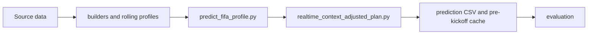

# Usage and Extension Guide

This guide starts from concrete tasks. All commands run from the repository root
and use `uv`.

## Choose a Task

| Goal | Command | Main result |
| --- | --- | --- |
| Reproduce the published metrics | `uv run python -m wc_model evaluate` | Evaluation CSV and two Markdown summaries in `output/` |
| Build the public model variant | `uv run python -m wc_model setup` | Prepared data, profiles, rankings, and predictions |
| Rebuild after editing model inputs | `uv run python -m wc_model build` | Refreshed prediction outputs |
| Inspect generated predictions | `uv run python -m wc_model inspect --date 2026-07-20` | Compact terminal table |
| Generate a daily report | `uv run python -m wc_model report 2026-07-20 --no-build` | `output/daily_reports/2026-07-20.md` |
| Add reviewed LLM context | `wc_model context prepare`, then `context apply` | Validated rows merged into three realtime input tables |
| Run an isolated experiment | `uv run python -m wc_model experiment run <name>` | Experiment-specific output without changing formal parameters |

## First Run

```powershell
git clone https://github.com/Lucifercoo/world-cup-prediction-model.git
cd world-cup-prediction-model
uv sync --frozen
uv run pytest -q
uv run python -m wc_model setup
uv run python -m wc_model inspect --team Spain
```

`setup` downloads reviewed redistributable data, generates documented public
proxies for restricted inputs, and executes the pipeline. It requires network
access. `evaluate` does not require the original 1.89 GB realtime cache because
the checked-in strict pre-match archive contains the minimum required forecast
state.

## Read the Output

The main machine-readable file is
`output/realtime_context_adjusted_plan.csv`. Important fields are:

| Field | Meaning |
| --- | --- |
| `predicted_outcome` | `A`, `D`, or `B`, using regulation time |
| `adjusted_p_a/p_draw/p_b` | Final outcome probabilities after pre-match context |
| `adjusted_xg_a/adjusted_xg_b` | Final expected goals for each team |
| `adjusted_total_goal_bucket` | Top-1 total-goal bucket |
| `backup_total_goal_bucket` | Top-2 total-goal bucket |
| `adjusted_score_1_model` | Main score inside Top-1 |
| `adjusted_score_2_aggressive_prediction` | Backup score inside Top-2; the historical name is retained for compatibility |
| `adjusted_score_3_market_value` | Independent squad-value reference constrained to Top-1 or Top-2 |
| `adjusted_score_4_upset` | Alternative outcome direction, usually a low score |
| `context_applied/shape_applied` | Whether reviewed realtime evidence changed the match |

To inspect a different compatible CSV:

```powershell
uv run python -m wc_model inspect --input path/to/predictions.csv --team France
```

## Collect Realtime Context with an LLM

1. Give the model `prompts/realtime_context_collection_zh.md` and the match.
2. Require JSON that conforms to `schemas/realtime_context_collection.schema.json`.
3. Record the actual model and reasoning effort. The historical run used
   `GPT-5.5` with `very_high` reasoning.
4. Save the JSON before kickoff. Different models may produce different valid
   judgments.
5. Validate, review, apply, and rebuild:

```powershell
uv run python -m wc_model context prepare context.json --output-dir output/context-package
uv run python -m wc_model context apply output/context-package
uv run python -m wc_model build
uv run python -m wc_model inspect --date 2026-07-20
```

`context apply` regenerates the CSV package from its JSON before changing data.
It then updates rows by stable keys instead of appending duplicates. Applying a
package changes model inputs, so commit or preserve the JSON evidence separately
when the run must be audited.

## Use Your Own Inputs

The public setup generates a FIFA-points squad-value proxy and disables the
optional key-player layer. Developers with lawfully obtained inputs can replace:

| Input | Schema |
| --- | --- |
| `data/transfermarkt_world_cup_2026_values.csv` | `schemas/transfermarkt_world_cup_2026_values.csv` |
| `data/world_cup_2026_key_player_signals.csv` | `schemas/world_cup_2026_key_player_signals.csv` |
| `data/fifa_rankings_annual_start.csv` | `schemas/fifa_rankings_annual_start.csv` |

Run `uv run python -m wc_model build` after replacement. The program rejects a
missing file, wrong header, or empty required dataset. Do not compare a custom
input run directly with the published realtime-assisted metrics unless its
provenance and pre-kickoff boundary are equivalent.

## Extend the Model



| Change | Primary file | Required check |
| --- | --- | --- |
| Rolling team strength or style features | `profiles.py` | Walk-forward cutoff remains before kickoff |
| Ranking or tournament state | `builders/` | State advances chronologically |
| Outcome, xG, total goals, score selection | `predict_fifa_profile.py` | Unit tests plus strict evaluation comparison |
| Realtime evidence effects | `realtime_context_adjusted_plan.py` | Input is available before kickoff and cached |
| Shared score/bucket contract | `prediction_rules.py` | Update contract tests and all consumers |
| Daily presentation | `reports/daily_match_report.py` | Generated Markdown contains all required columns |
| New experiment | `experiments/<name>.py` and `EXPERIMENTS` in `wc_model.py` | Writes only isolated experiment output |

Use this sequence for a model change:

1. State the mechanism and which output it should affect.
2. Implement it in one layer, without post-match special cases.
3. Add focused tests.
4. Run `uv run pytest -q`.
5. Run the relevant registered experiment.
6. Compare outcome, goal Top-1/Top-2, exact-score coverage, score-bucket coverage,
   and median normalized deviation.
7. Adopt the change only when the aggregate result and affected matches support
   the mechanism.

Post-match commentary may explain an error and update future state. It must not
rewrite the cached forecast for the match that produced the evidence.
